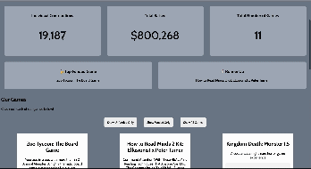

# WEB102 Prework - _Sea Monster Funding_

Submitted by: **Rosa Figueroa**

**Sea Monster Funding** is a website for the company Sea Monster Crowdfunding that displays information about the games they have funded.

Time spent: **2** hours spent in total

## Required Features

The following **required** functionality is completed:

- [x] The introduction section explains the background of the company and how many games remain unfunded.
- [x] The Stats section includes information about the total contributions and dollars raised as well as the top two most funded games.
- [x] The Our Games section initially displays all games funded by Sea Monster Crowdfunding
- [x] The Our Games section has three buttons that allow the user to display only unfunded games, only funded games, or all games.

## Video Walkthrough

Here's a walkthrough of implemented features:

<!-- Replace this with whatever GIF tool you used! -->

GIF created with Quicktime Player and Adobe.

## Notes

I had difficulties knowing the exact syntax and methods used to create a new element and append to DOM.

## License

    Copyright [yyyy] [name of copyright owner]

    Licensed under the Apache License, Version 2.0 (the "License");
    you may not use this file except in compliance with the License.
    You may obtain a copy of the License at

        http://www.apache.org/licenses/LICENSE-2.0

    Unless required by applicable law or agreed to in writing, software
    distributed under the License is distributed on an "AS IS" BASIS,
    WITHOUT WARRANTIES OR CONDITIONS OF ANY KIND, either express or implied.
    See the License for the specific language governing permissions and
    limitations under the License.
